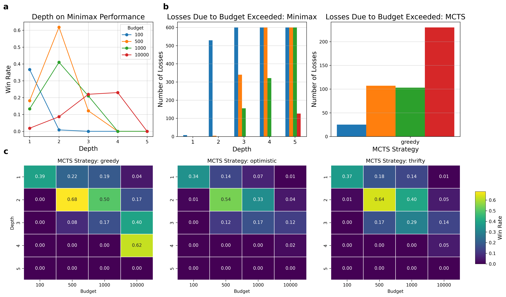
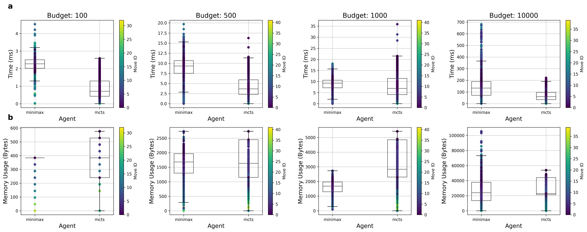
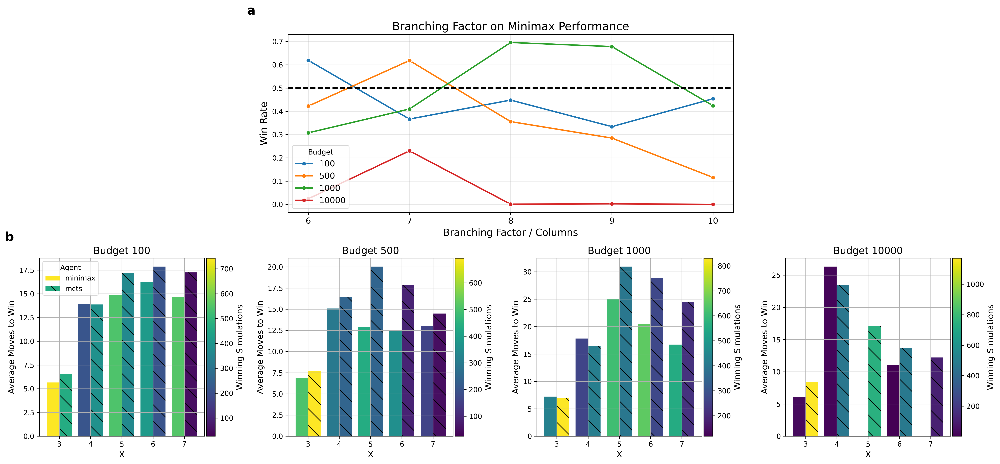

# Connect 4: MCTS vs Minimax

Empirical comparison of MCTS and Minimax Search for Connect 4.

<div align="center">
  
</div>

## Run

```
$ cd c4-search
$ pip install -r requirements.txt
$ python3 main.py
```

## Results

<div align="center">
  
  <p><em>Fig. 2. a,b,c, Analysis of game results. a, Line plot of the effect of Minimax’s depth on its (adjusted) win rate across multiple budgets. b, Bar plots of number of losses due to forfeit/budget depletion across multiple budgets. Color scheme follows that of a. Left: Comparison of Minimax depths. Right: Greedy MCTS. c, Heatmaps of Minimax’s win rate across multiple depths, budgets and MCTS strategies. Each map represents a strategy. Color scheme maps win rate.</em></p>
</div>

<div align="center">
  
  <p><em>Fig. 3. a,b, Visualization of result-agnostic performance metrics. Only Minimax’s best depth at each budget. Color scheme represents the timing of each move, indicating how early or late in the game it was performed. a, Box plot visualization of time (ms) taken to pick a move across all budgets. b, Box plot visualization of approximation of memory (bytes) consumed at each move. Calculated as mean(M inimaxN ode(bytes)÷ M CT SN ode(bytes)).</em></p>
</div>

<div align="center">
  
  <p><em>Fig. 4. a,b, Simulations extended to variable board/rule configurations. Again, Mini- max’s depths at each budget were chosen according to the previous analysis. a, Line plot visualization of effect of game’s branching factor (board’s number of columns) over Minimax’s win rate across multiple budgets. The dashed line marks the 50% win rate, with every point above it indicating performance superior to that of MCTS. b, Bar plots showcasing the average number of moves played to reach a win across X values. Every plot represents a budget, the color scale indicates the number of simulations taken into account to compute the average and the hatch indicates the agent.</em></p>
</div>

## Credits

* [m4mbo](https://github.com/m4mbo) - Code, report.


